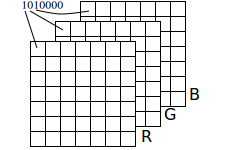
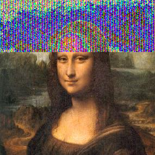

# Image-Steganography

Image steganography is the process of hiding a message, for example, a text T in between the images. In the presented scripts, the value relative to the pixel color of the image was changed to its binary value, that is, 88 becomes 1011000. Thus, the encoding of the text into the image was performed in a way that the altered bit (bit band) is chosen as user input parameter (from position 0 to 7). In addition to changing the bit band we opted to intercalate the color channel modifications (alternating between the R, G then B channels).It is logical to infer that the greater the position chosen to alter the bit, the more it can be noticed that there might be something abnormal hidden in the middle of the chosen image.

**Intercalating between channels:**



## Usage

The algorithm was implemented in Python in version 2.7.12. All operations are implemented in three different files called "convert.py", "find_msg.py" and "evd_pxl.py". The program can be executed by terminal, execute the python convert.py command to do the steganography, python find_msg.py to read the text and python evd_pxl.py to highlight the changed pixels. The program is executed with images in PNG format only. The partial results of the operations are stored in the folder that contains the scripts. All saved images have PNG extension.

```
python convert.py
monalisa
texto
0
```

```
python find\_msg.py
monalisa_outfile
0
```

```
python evd\_pxl.py
monalisa_outfile
0
```
## Expected results:

         


